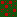
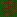

# VS Village

VS Village is an attempt to bring a village system right into Vintage Story. It introduces a wide variety of villagers, each of them with different day time routines. There are __soldiers__ who defend the village, __farmers__ who will watch the field, __shepherds__ that will take care of cattle, and a small selection of other professions. Each of these villagers will need a __workstation__ and a __place to sleep__ at night.

## Village Generator

This mod comes with its own simple village generation system. The approach we follow in this mod to generate a village is simple yet powerful. Due to its simplicity however it comes with a couple of drawbacks that hopefully become clear when talking about its functionality.\
To generate a village during worldgen or via command (try `/genvillage`), a grid system is used which operates as follows:

<table style="border-collapse:collapse;border-width:0px;">
    <tr style="border-color:black;border-style:solid;border-width:0px;">
        <td style="border-color:black;border-style:solid;border-width:0px;max-width:800px">
            
        </td>
        <td style="border-color:black;border-style:solid;border-width:0px;max-width:800px">
            An empty  grid is generated. The size of the grid depends on the size of the village that needs to be created. So far it is usually 9x9, 17x17 or 25x25 pixels wide. As all of the affected chunks need to be loaded during village generation, we can not really create any larger villages with this system. There is a <a href="resources/assets/vsvillage/config/villagetypes.json">list of available villages</a> defined in this mod. A fitting villages is choosen randomly from this list and the grid is initialized accordingly. Each entry in that list defines the contents and size of the village. It states how many types of certain houses it needs, for example 3 gardens, 2 farmers houses and 1 soldier watchtower. In a <a href="resources/assets/vsvillage/config/villagestructures.json">separate list</a> a bunch of houses are specified to be matched to the village types. Each house has a unique id, a non unique type (e.g. garden, farmer, soldier) as well as attributes for its size and a link to the schematic file.
        </td>
    </tr>
    <tr style="border-color:black;border-style:solid;border-width:0px;">
        <td style="border-color:black;border-style:solid;border-width:0px;max-width:800px">
            
        </td>
        <td style="border-color:black;border-style:solid;border-width:0px;max-width:800px">
            After creating the village grid, it is time to put some  houses inside. The necessary houses for the current village type are selected randomly depending on the types needed to create the village. Each selected house is then randomly rotated and placed inside the grid with a single  path in front of its main door. During that process we need to keep in mind that between every two houses there needs to be at least one empty space for a path, so we can not just place them anywhere.
        </td>
    </tr>
    <tr style="border-color:black;border-style:solid;border-width:0px;">
        <td style="border-color:black;border-style:solid;border-width:0px;max-width:800px">
            
        </td>
        <td style="border-color:black;border-style:solid;border-width:0px;max-width:800px">
            The entrances of all house are connected with path blocks. The village is now completely simulated and ready to be generated into the world. Therefore the pixel coordinates of the grid system need to be converted back into in game coordinates. Each path square is 3x3 blocks wide, whereas each small house is 7x7 blocks wide. The coordinates [x, y] on the grid therefore translate into [x * 3 + (x / 2) * 4, y * 3 + (y / 2) * 4] in game coordinates. After translating the grid coordinates into the real ones, all house schematics and path blocks are placed and the village is generated for players to explore.
        </td>
    </tr>
</table>